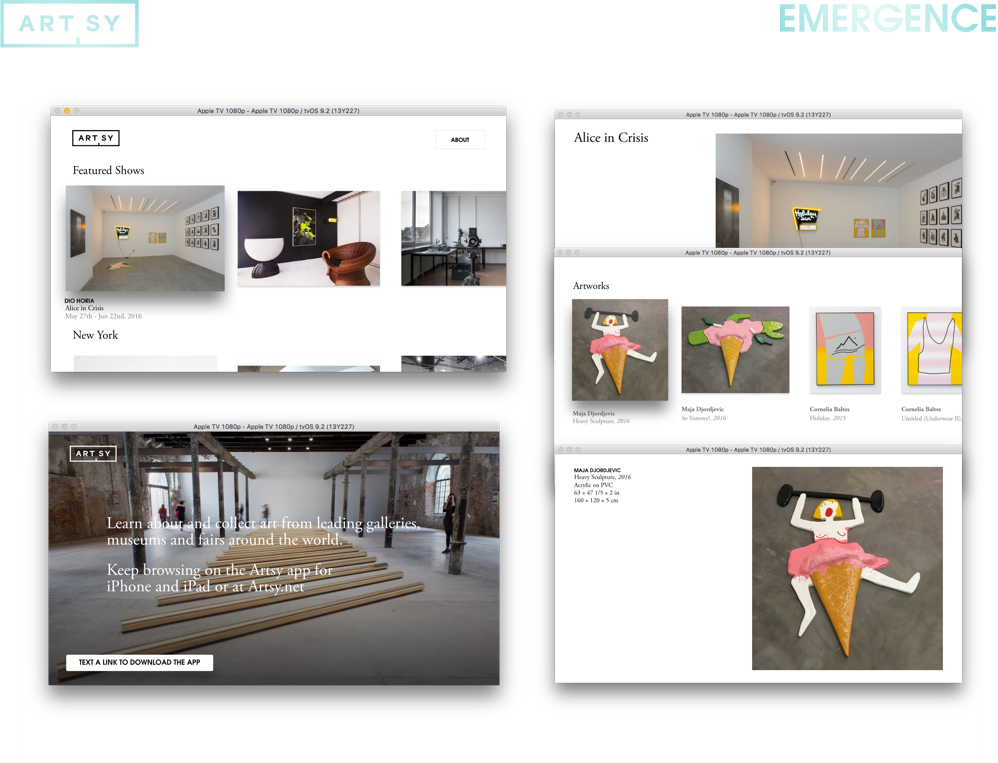

### Meta

* __State:__ production
* __Point People:__ [@orta](https://github.com/orta)

This is a core [Artsy Mobile](https://github.com/artsy/mobile) OSS project, along with [Energy](https://github.com/artsy/energy), [Eidolon](https://github.com/artsy/eidolon), [Emission](https://github.com/artsy/emission) and [Eigen](https://github.com/artsy/eigen).

Don't know what Artsy is? [Check this](https://github.com/artsy/mobile/blob/master/what_is_artsy.md) overview, or read our objc.io on [team culture](https://www.objc.io/issues/22-scale/artsy/).

Want to know more about Emergence? Read the [mobile](http://artsy.github.io/blog/categories/mobile/) blog posts, or [emergence's](http://artsy.github.io/blog/categories/emergence/) specifically.

### Installation

Run this in your shell:

```sh
git clone https://github.com/artsy/Emergence.git
cd Emergence
bundle install
make oss # Artsy staff, go look in 1password
bundle exec pod install
open "Emergence.xcworkspace"
```

## License

MIT License. See [LICENSE](LICENSE).
